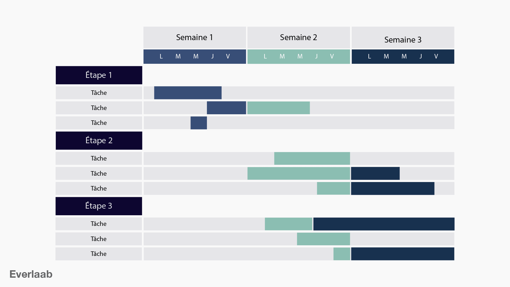

# Diagramme de Gantt

## Qu'est-ce qu'un diagramme de Gantt ?

Le diagramme de Gantt est un outil visuel essentiel en gestion de projet qui permet de représenter graphiquement le calendrier d'un projet. Il illustre le début et la fin de différentes tâches dans un projet, ainsi que leur chevauchement et leur relation les unes avec les autres. Cela permet aux gestionnaires de projet de suivre facilement l'avancement du projet et de repérer les retards potentiels.

## Détails du diagramme de Gantt

### Composition d'un diagramme de Gantt

Un diagramme de Gantt typique se compose des éléments suivants :

- **Axes :** L'axe horizontal représente le temps, généralement divisé en jours, semaines ou mois, tandis que l'axe vertical liste les tâches du projet.
- **Barres :** Chaque tâche est représentée par une barre horizontale; la position et la longueur de la barre indiquent le début, la durée et la fin de la tâche.
- **Dépendances :** Les flèches ou lignes reliant les tâches montrent les dépendances, indiquant comment une tâche est liée à une autre et l'ordre dans lequel les tâches doivent être réalisées.
- **Jalons :** Certains diagrammes incluent des jalons, qui sont des indicateurs de points clés ou d'objectifs importants dans le projet.

### Avantages

- **Clarté :** Offre une visualisation claire de la chronologie du projet et de l'état d'avancement des tâches.
- **Planification :** Aide à la planification et à la répartition des ressources.
- **Communication :** Facilite la communication des délais et de l'avancement avec les parties prenantes.
- **Suivi :** Permet un suivi facile des délais et l'identification des retards.

### Exemple de diagramme de Gantt

*Cet exemple illustre la chronologie des tâches, leurs dépendances, et comment elles se chevauchent sur le calendrier du projet.*

### Outils pour réaliser un diagramme de Gantt

Il existe de nombreux outils, allant de logiciels spécialisés à des solutions en ligne, pour créer et gérer des diagrammes de Gantt. Voici quelques options populaires :

1. **Microsoft Project :** Un des outils de gestion de projet les plus robustes, offrant des fonctionnalités avancées pour la création de diagrammes de Gantt.
2. **Asana :** Populaire pour la gestion de projet en équipe, il offre des fonctionnalités de diagramme de Gantt dans sa version premium.
3. **Trello (avec des extensions comme Planyway) :** Bien que Trello soit basé sur le système de cartes Kanban, l'ajout de Planyway permet de visualiser les projets sous forme de diagramme de Gantt.
4. **Smartsheet :** Une plateforme de gestion de travail en ligne qui offre des capacités de diagramme de Gantt puissantes et flexibles.
5. **ClickUp :** Un outil tout-en-un pour la gestion de projet qui inclut des fonctionnalités de diagramme de Gantt.

### Conseils pour l'utilisation de diagrammes de Gantt

- **Mettre à jour régulièrement :** Les diagrammes de Gantt doivent être mis à jour régulièrement pour refléter l'avancement réel du projet.
- **Inclure les marges de manœuvre :** Il est important d'inclure des marges de manœuvre dans les délais pour tenir compte des imprévus.
- **Partager avec les parties prenantes :** Les diagrammes de Gantt doivent être partagés avec toutes les parties prenantes pour une meilleure communication et compréhension du projet.

## Ressources supplémentaires

- [Modèles de diagramme de GANTT](https://fr.venngage.com/blog/modeles-diagrammes-gantt-projet/#1)
