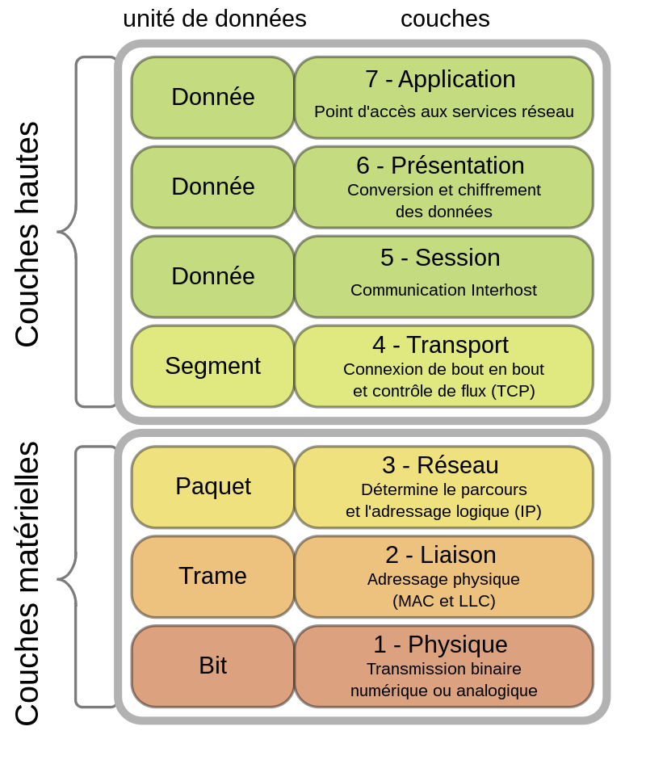

# Le modèle OSI (Open Systems Interconnection)

## Introduction

Le modèle OSI (Open Systems Interconnection) est un modèle conceptuel qui divise les fonctions de communication en réseau en sept couches distinctes. Il a été créé en 1984 par l'Organisation Internationale de Normalisation (ISO), une entité internationale qui établit des normes dans de nombreux domaines, y compris les technologies de l'information.

## Objectifs d'apprentissage

À la fin de cette lecture, vous serez en mesure de :

- Décrire les sept couches du modèle OSI.
- Expliquer les fonctions de chaque couche du modèle OSI.
- Identifier les protocoles et les dispositifs associés à chaque couche du modèle OSI.

## Les sept couches du modèle OSI

Le modèle OSI est divisé en sept couches, chacune ayant des fonctions spécifiques dans le processus de communication en réseau. Les couches sont numérotées de 1 à 7, de la couche la plus basse à la couche la plus haute. Chaque couche fournit des services à la couche supérieure et utilise les services de la couche inférieure.

**Figure 1. Les sept couches du modèle OSI (Wikipedia : https://fr.wikipedia.org/wiki/Mod%C3%A8le_OSI)**

### 1. Couche Physique

La couche physique est la première couche du modèle OSI. Elle est responsable de la transmission de données brutes sur un support physique. Elle définit les caractéristiques électriques, mécaniques, fonctionnelles et procédurales pour l'activation, l'entretien et la désactivation des connexions physiques pour la transmission de bits. Elle définit également les caractéristiques de la transmission de données sur le support physique, y compris les connecteurs, les broches, les niveaux de tension, les débits de données et les débits de signalisation.

Les dispositifs de la couche physique comprennent les câbles, les connecteurs, les adaptateurs, les répéteurs, les concentrateurs et les modems.

### 2. Couche de Liaison de Données

La couche de liaison de données est la deuxième couche du modèle OSI. Elle gère la communication entre les dispositifs sur un réseau local. Elle définit les procédures pour l'établissement et la libération de connexions physiques entre les dispositifs. Elle définit également les procédures pour la détection et la correction des erreurs qui peuvent survenir lors de la transmission de données sur le support physique.

Les dispositifs de la couche de liaison de données comprennent les commutateurs et les ponts.

### 3. Couche Réseau

La couche réseau est la troisième couche du modèle OSI. Elle est responsable du routage des paquets de données entre différents réseaux. Elle définit les procédures pour l'acheminement des paquets de données à travers un ou plusieurs réseaux. Elle définit également les procédures pour la fragmentation et le réassemblage des paquets de données.

Les dispositifs de la couche réseau comprennent les routeurs et les commutateurs de couche 3.

### 4. Couche de Transport

La couche de transport est la quatrième couche du modèle OSI. Elle est responsable de la livraison fiable des données entre les points d'un réseau. Elle définit les procédures pour l'établissement et la libération de connexions logiques entre les dispositifs. Elle définit également les procédures pour la segmentation et le réassemblage des données.

Les dispositifs de la couche de transport comprennent les passerelles et les pare-feux.

### 5. Couche de Session

La couche de session est la cinquième couche du modèle OSI. Elle est responsable de la gestion des sessions de communication entre les applications. Elle définit les procédures pour l'établissement, le maintien et la fin des sessions de communication. Elle définit également les procédures pour la synchronisation des données et la reprise après une panne.

### 6. Couche de Présentation

La couche de présentation est la sixième couche du modèle OSI. Elle est responsable de la traduction des données pour les applications. Elle définit les procédures pour la traduction des données d'un format à un autre. Elle définit également les procédures pour le chiffrement et la compression des données.

### 7. Couche Application

La couche application est la dernière couche du modèle OSI. Elle fournit des services réseau aux applications. Elle définit les procédures pour l'interaction entre les applications et les utilisateurs. Elle définit également les procédures pour l'interaction entre les applications et les services réseau.

